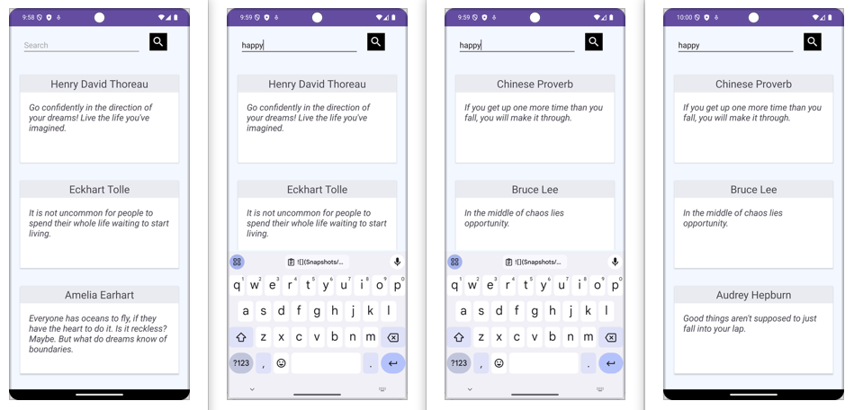

# QuoteWell App

QuoteWell is an Android application that allows users to fetch and display quotes based on a specified keyword. It utilizes the ZenQuotes API for fetching quotes.

## Features

- Fetch quotes based on a keyword.
- Display a list of quotes.
- Simple and clean user interface.

  

## Technologies Used

- Java
- Android SDK
- Volley for network requests

## Setup and Installation

1. **Clone the repository:**

    ```bash
    git clone https://github.com/yourusername/quotewell.git
    ```

2. **Open the project in Android Studio:**
    - Open Android Studio.
    - Select `File` -> `Open...` and navigate to the cloned repository.
    - Click `OK` to open the project.

3. **Build the project:**
    - Click the `Build` button in Android Studio to build the project and resolve any dependencies.

4. **Run the app:**
    - Connect an Android device or start an emulator.
    - Click the `Run` button in Android Studio to install and start the app on the device/emulator.

## Usage

1. Open the QuoteWell app on your Android device.
2. Enter a keyword in the search bar.
3. Click the `Fetch Quotes` button to retrieve quotes related to the entered keyword.
4. The app will display the fetched quotes in a list format.

## Code Overview

### Main Components

- **MainActivity.java:** The main activity that handles user input and displays quotes.
- **QuoteModelControllerAPI.java:** Handles API requests to fetch quotes from ZenQuotes.
- **QuotesModelList.java:** A model class that stores a list of quotes.
- **QuoteModel.java:** A model class that represents a single quote.

### API Integration

The app uses the ZenQuotes API to fetch quotes based on a keyword. The API integration is handled in the `QuoteModelControllerAPI` class using the Volley library.

### Example API Request

The API request is made to the following URL format:

```java
private String baseURL = "https://zenquotes.io/api/quotes/keyword=%s";

